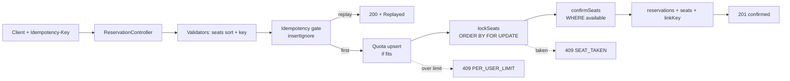
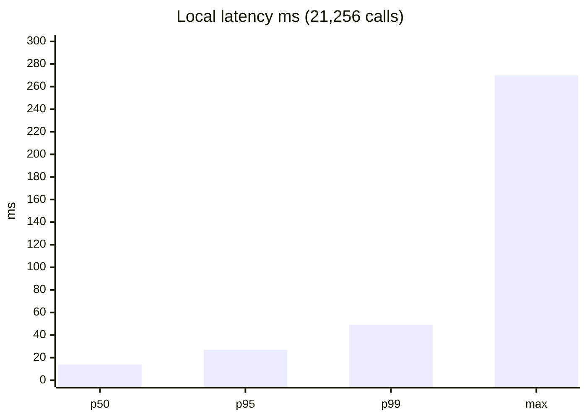
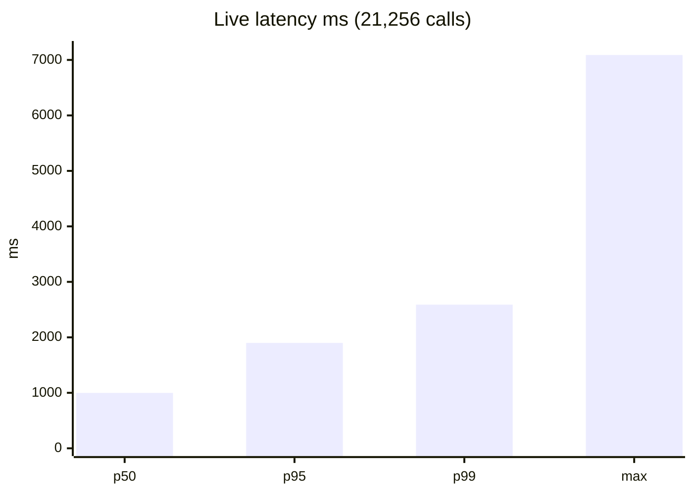
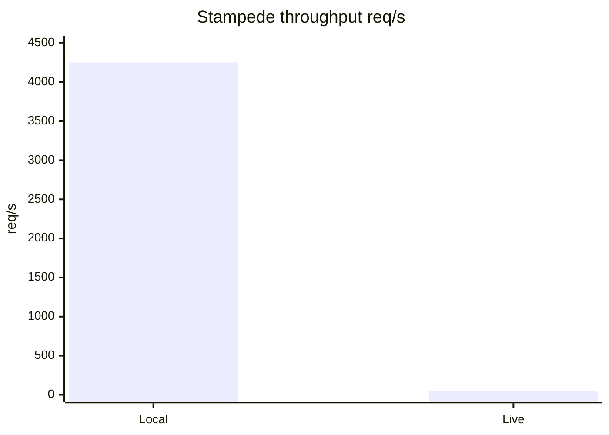

# Book My Seat

Seat-reservation system of record built for on-sale stampedes. One seat is
confirmed to exactly one user — no double-sells, even when thousands race for
the same seat in the same second.

Java 21 · Spring Boot 3.5 · PostgreSQL 16 · Flyway · Docker

> Live URL: https://book-my-seat-7pdy.onrender.com — deployed from this
> repo via `render.yaml`. Everything below works against
> `http://localhost:8080` today and against the live URL unchanged.

## Quick start (only Docker needed)

```bash
git clone https://github.com/shivanigotavade/book-my-seat.git
cd book-my-seat
docker compose up --build
curl http://localhost:8080/health/ready   # {"status":"UP","db":"UP"}
```

With observability profile: `docker compose --profile observability up --build`
(Prometheus on `:9090` scraping `/metrics`).

Local build without Docker: `./mvnw -B verify` (unit tests run; `*IT`
integration tests need Docker and skip otherwise).

## Tokens

```bash
# USER token for load testing (when the dev endpoint is enabled)
curl -s -X POST localhost:8080/auth/token \
  -H 'Content-Type: application/json' -d '{"user_id":"alice"}'
# → {"token":"…","token_type":"Bearer","user_id":"alice","role":"USER","expires_in":86400}

# Admin calls use the static token (or a minted ADMIN JWT, below):
ADMIN="Authorization: Bearer admin-token"

# Short-lived ADMIN JWT via the bootstrap secret:
curl -s -X POST localhost:8080/auth/token \
  -H 'Content-Type: application/json' \
  -H 'Authorization: Bearer admin-token' \
  -d '{"user_id":"ops","role":"ADMIN"}'
# → {"token":"…","role":"ADMIN",…} — use as bearer on admin routes.
```

> Deliberate take-home choice: `ADMIN_TOKEN` keeps its documented default
> (`admin-token`) on the live deployment so graders can create shows
> with zero setup — run the burst the same way:
> `ADMIN_TOKEN=admin-token ./burst.sh <live-url>`. `JWT_SECRET` is
> always a random per-deploy value (Render generates it); it is never
> needed by callers. For a real production, generate both and distribute
> the admin value out of band.

## API

```bash
BASE=localhost:8080
ADMIN="Authorization: Bearer admin-token"
ALICE="Authorization: Bearer <alice-jwt>"

# Create a show (ADMIN)
curl -X POST $BASE/shows -H "$ADMIN" -H 'Content-Type: application/json' -d '{
  "name": "Rock Night", "seats": ["A1","A2","A3"],
  "price_paise": 25000, "per_user_limit": 4}'

# Show state (public; ?summary=true for counts only)
curl $BASE/shows/<show-id>
curl "$BASE/shows/<show-id>?summary=true"

# Reserve (authenticated; replay returns 200 + Idempotent-Replayed: true)
curl -X POST $BASE/shows/<show-id>/reserve -H "$ALICE" \
  -H 'Content-Type: application/json' \
  -d '{"seats":["A1"],"idempotency_key":"k-1"}'

# Cancel (owner only)
curl -X POST $BASE/reservations/<reservation-id>/cancel -H "$ALICE"

# Health / metrics (public)
curl $BASE/health/live
curl $BASE/health/ready
curl $BASE/metrics
```

Error bodies are uniform: `{"error":{"code":"SEAT_TAKEN","message":"…",
"details":{"seats":["A1"]},"request_id":"…"}}` — every response also echoes
`X-Request-Id` for log correlation. Domain declines are `4xx`
(`SEAT_TAKEN`, `PER_USER_LIMIT`, `IDEMPOTENCY_KEY_REUSED`, `INVALID_SEAT`,
`VALIDATION_ERROR`, `UNAUTHENTICATED`, `FORBIDDEN`, `NOT_FOUND`,
`RETRY_LATER` + `Retry-After`); the only intentional `5xx` is `503` from
`/health/ready` when the database is down.

## How it works

- **Explicit cancel, no TTL:** reserve confirms immediately; cancel frees.
  No expiry sweeper racing confirmations.
- **All-or-nothing multi-seat:** any unavailable seat declines the whole
  request; quota untouched.
- **Replay is `200`, not `201`:** exactly one `201` per hot seat even when
  the winner retries.
- **DB as arbiter:** sorted `FOR UPDATE` locks + guarded
  `UPDATE … WHERE status='available'` + partial unique index safety net;
  per-user limit via conditional counter update; idempotency via
  same-transaction unique key + request hash.
- **Consistency over availability:** single Postgres primary; readiness
  fails closed (`503`) on partition.



## Burst (on-sale stampede)

```bash
./burst.sh http://localhost:8080
make burst BASE_URL=https://book-my-seat-7pdy.onrender.com
```

Needs only Java 21. Runs the hot-seat storm (500 × `A12`), a ~20k-request
stampede with replays, idempotency/limit/spoof/cancel checks, then
`available + held + confirmed == total_seats` plus metrics reconciliation
(`confirmed_total` delta vs client `201`s). Prints PASS/FAIL per check and
exits non-zero on failure. Tune via `SHOW_SEATS HOT_USERS STAMPEDE_REQUESTS
HOT_SET STAMPEDE_USERS IDEM_RETRIES ADMIN_TOKEN` (plus `STAMPEDE_CONCURRENCY`,
`STORM_CONCURRENCY`, `SETUP_CONCURRENCY` — sustained pressure metering, not
one instant socket pile-on).

> Live URL resource limits (Render free tier: small CPU/RAM, managed
> Postgres connection cap, `HIKARI_MAX_POOL_SIZE=10`): run the 20k stampede
> metered with `STAMPEDE_CONCURRENCY=50 STORM_CONCURRENCY=50
> SETUP_CONCURRENCY=10` — defaults (1000/500/50) pile on and stall to `0/s`.
> Same 20k total, sustained pressure:

```bash
STAMPEDE_CONCURRENCY=50 STORM_CONCURRENCY=50 SETUP_CONCURRENCY=10 STAMPEDE_REQUESTS=20000 ./burst.sh https://book-my-seat-7pdy.onrender.com
```

Observed (21,256 calls, 20k stampede + storm/replay/limit/spoof/cancel):

| Env | Throughput | p50 | p95 | p99 | max | Full log |
|-----|------------|-----|-----|-----|-----|----------|
| Local direct app, no Docker (`50/50/10`) | ~4251/s stampede | 14ms | 27ms | 49ms | 270ms | [`burst_logs/local_stampede.txt`](burst_logs/local_stampede.txt) |
| Render free (metered 50/50/10) | ~49/s stampede | 998ms | 1899ms | 2590ms | 7088ms | [`burst_logs/live_stampede.txt`](burst_logs/live_stampede.txt) |

Live is slower by design (shared CPU/RAM, managed-PG cap, + cold start) — same `PASS`, longer wall time. Both logs end `RESULT: PASS` with storm `201=1 409:SEAT_TAKEN=499`, `zero 5xx / zero network errors`, and `available + held + confirmed == total_seats`.







## Configuration

| Var | Default (local) | Meaning |
|-----|-----------------|---------|
| `PORT` | `8080` | HTTP port (injected by PaaS — never hardcode in deploy) |
| `DATABASE_URL` | `jdbc:postgresql://localhost:5432/book_my_seat` | JDBC URL, or provider `postgres://…` form (auto-converted) |
| `DB_USER` / `DB_PASSWORD` | `${DB_USER}` / `${DB_PASSWORD}` | Local-dev defaults; always set explicitly via env in compose/deploy (ignored when `DATABASE_URL` embeds them) |
| `JWT_SECRET` | (optional) | HS256 secret, ≥ 32 chars, random per deploy; never shared |
| `ADMIN_TOKEN` | `admin-token` | Static admin bearer for `POST /shows`; default works as-is, override per deploy (see Tokens) |
| `AUTH_DEV_TOKEN_ENDPOINT_ENABLED` | `true` | Set `false` in prod to disable `POST /auth/token` |
| `JWT_EXPIRATION_SECONDS` | `86400` | Token lifetime |
| `HIKARI_MAX_POOL_SIZE` / `HIKARI_MIN_IDLE` | `15` / `5` | Pool sizing (stay under the managed-PG connection cap) |
| `LOG_LEVEL` | `INFO` | Root + app log level |

Details, trade-offs and next steps: [`WRITEUP.md`](WRITEUP.md).
AI usage is disclosed there as required.
