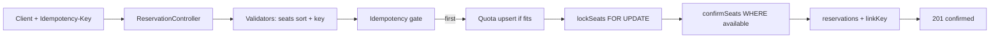

# Book My Seat — Write-up

> 20k stampede, one winner per hot seat, zero `5xx`, invariant holds.
> Proof: [`README.md`](README.md) burst table + [`burst_logs/local_stampede.txt`](burst_logs/local_stampede.txt) + [`burst_logs/live_stampede.txt`](burst_logs/live_stampede.txt) — both end `RESULT: PASS`.

## TL;DR

| Guarantee | How | Where |
|---|---|---|
| No double-sell | Sorted `FOR UPDATE` + guarded `UPDATE … WHERE available` + partial unique index | `service/ReservationService`, `repository/SeatRepository#lockSeats/confirmSeats` |
| Per-user limit 4 | Conditional `INSERT … ON CONFLICT DO UPDATE … WHERE fits` | `repository/UserShowQuotaRepository#upsertIncrementIfFits` |
| Exactly-once retry | Same-tx key `(user,show,key)` + `SHA-256(show\|seats)` | `repository/IdempotencyKeyRepository`, `validator/*`, `domain/*` |
| Zero `5xx` | Domain → `4xx`, contention → `429`, retry 3× outside tx | `exception/handler/*`, `common/TransactionRetry` |
| Invariant | Single-snapshot read | `service/ShowService#getShow` |
| Token identity | JWT/`ADMIN_TOKEN` → `AuthPrincipal`, owner-check on cancel | `security/*`, `controller/*` |

## The atomic decision

`service/ReservationService#reserveTx` runs one `READ COMMITTED` transaction in global lock order:

1. Idempotency row — `INSERT … ON CONFLICT DO NOTHING`
2. Quota row — `upsertIncrementIfFits` (row lock serialises same user)
3. Seats sorted — `SELECT … ORDER BY seat_label FOR UPDATE`
4. Reservation row — fresh UUID insert, no contention

Race-free because the decision is taken **while holding every seat lock** and re-checked after: 500×`A12` queue, winner commits `confirmed`, followers see `confirmed` → `409 SEAT_TAKEN`. Belt-and-braces guarded write (rows must equal request size) + partial unique `ON (show_id, seat_label) WHERE active` makes double-hold impossible even with an app bug.

Multi-seat is all-or-nothing: any unavailable seat declines all, quota rolls back. Sorted labels mean `[A1,A2]` and `[A2,A1]` lock identically — no deadlock. Leftover transient contention (`40P01`/`40001`/`55P03`/pool) retries 3× with jitter **outside** the tx, then `429 RETRY_LATER`. `lock_timeout 8s` / `statement_timeout 25s` bound waits. Only pre-lock read is immutable show config (cached); no read-then-write on contested rows.

## Idempotency

Key from `Idempotency-Key` header or `idempotency_key` body (differ → `400`), scoped `(user_id, show_id, key)` — same key on another show is independent (V2 re-key). Fingerprint `SHA-256(show_id | sorted seats)` (`idempotency/RequestHasher`). Stored **in the same transaction** as the reservation, so exactly-once is DB-enforced:

- First sight: key inserts, `reservation_id` linked before commit.
- Same key + same hash: stored reservation returns `200 + Idempotent-Replayed: true` before quota/seats move — one `201` per hot seat.
- Same key + different hash: `409 IDEMPOTENCY_KEY_REUSED`.
- Declined first attempt rolls back the key → reusable. Concurrent same-key blocks on the key row — no double window.

## Holds & expiry

Explicit cancel only: reserve → `confirmed` immediately, `POST /reservations/{id}/cancel` is the sole release. No TTL sweeper racing confirms. Cancel keeps lock order (quota → seats sorted → reservation) with guarded transitions on both sides (`reservations WHERE status='confirmed'`, `seats WHERE reservation_id=:id`) — a late duplicate cancel never frees a re-booked seat. Repeat cancel → idempotent `200`, no double decrement. Quota counts active seats, decrements on cancel.

## Consistency vs availability under a partition

Single Postgres primary = source of truth: choose consistency, fail closed. DB down/wedged → `/health/ready` `503` (2s `SELECT 1`); business endpoints shed as `429`, never guess. No split-brain; bookings refuse while partitioned, recover without restart. Replicas (future) serve only show-state reads, never the decision.

## Observability — what pages at 2am

- `ready != 200`: DB down — page.
- Any `5xx` on business routes: must be zero — page.
- `429` / `tx_retries_total{cause}` spike: contention beyond design.
- `p99` (`http_server_requests_seconds`): lock/pool queueing.
- `hikaricp_connections_pending`: pool saturated (stay under PG cap).
- Gauge drift (`seats_available` vs `GET /shows`, `confirmed_total` vs client `201`s): counting bug — page.
- `reservations_confirmed` → 0 during on-sale: upstream/DB stall.

Every response carries `X-Request-Id` (inbound or generated) echoed in `ApiError` (`domain/ApiError`) + JSON logs (`request_id,user_id,show_id,key` preview) with one line per decision (`confirmed/declined/replayed/cancelled`). Logs: stdout JSON in prod, rolling file locally.

## Proven numbers

21,256 calls, metered `50/50/10`:

| Env | Throughput | p50 | p95 | p99 | max |
|-----|------------|-----|-----|-----|-----|
| Local direct, no Docker | ~4251/s | 14ms | 27ms | 49ms | 270ms |
| Render free | ~49/s | 998ms | 1899ms | 2590ms | 7088ms |

Full evidence in [`README.md`](README.md) + `burst_logs/`.

## Performance notes

Same guarantees, fewer round trips: cached immutable show config, single-statement quota upsert, JDBC batching, env-driven pool. Lock order, retry, logging untouched. Burst meters concurrency so 20k measures sustained pressure, not socket pile-on.

## What I'd do next

TTL holds + guarded sweeper · hold → pay → confirm saga · per-user/IP limits + waiting room · categories/pricing · sharded hot shows + Redis pre-filter · read replicas for state · outbox events.

## AI usage

Built with OpenCode/Muse Spark, per-goal direction:

**Directed:** Flyway over `ddl-auto`, G1→G22 order, all-or-nothing/explicit-cancel/replay-`200`/consistency-first policies, Render target, `domain`/`validator`/`exception.handler` package moves.

**Decided:** conditional quota SQL, `TransactionTemplate` + retry helper, `SNAKE_CASE`, aggregate gauges, `set_config` timeouts, `EnvironmentPostProcessor` URL rewrite, single-file burst.

**Rejected/fixed:** `ddl-auto=create` (no partial-index support); `@Valid` non-uniform 400s → manual validation; `@WebMvcTest` default-security 403s → explicit `@Import(SecurityConfig)`; cancel double-decrement → guarded-transition + reread; burst `code()` nested-error parse; `prometheusmetrics` rename. Concurrency proofs (`ReserveServiceIT`, `ShowServiceIT`, `./mvnw verify`) re-run in CI.
